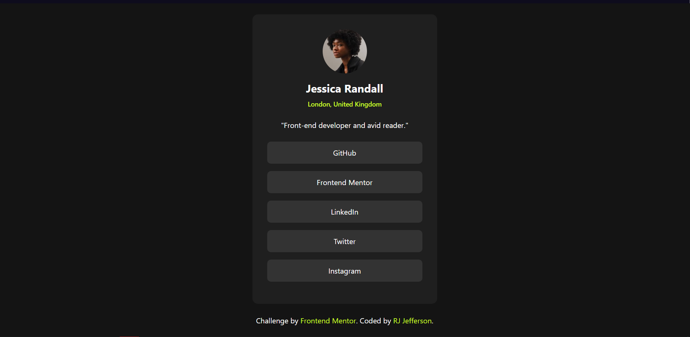

  

  <h2 align="center">Social links profile Solution</h2>
  

    <a href="https://www.frontendmentor.io/challenges/social-links-profile-UG32l9m6dQ"><strong>Frontend Mentor Challenge</strong></a>
     
     
    <a href="https://jeffersonrj14.github.io/frontendmentor-solution/solution/newbie/social-links-profile-tailwind/src/index.html">View Demo</a>
  

  <!-- Profile -->
  
  <!-- Status -->
    

This is a solution to the [Social Links Profile Challenge on Frontend Mentor](https://www.frontendmentor.io/challenges/social-links-profile-UG32l9m6dQ)
challenges help you improve your coding skills by building realistic projects.

<h2 align="center">Links</h2>

- Solution URL: [Social Links Profile Website (HTML + Tailwind) | Frontend Mentor](https://www.frontendmentor.io/solutions/social-links-profile-html-tailwind-AJFqwX92cH)
- Live Site URL: [https://social-links-profile-tailwind.vercel.app](https://jeffersonrj14.github.io/frontendmentor-solution/solution/newbie/social-links-profile-tailwind/src/index.html)

 

## Table of contents

- [Overview](#overview)
  - [The challenge](#the-challenge)
- [My process](#my-process)
  - [Built with](#built-with)
  - [Useful Resources](#useful-resources)
- [Author](#author)

## Overview

### The challenge

Users should be able to:

- See hover and focus states for all interactive elements on the page

## My process

### Built with

- HTML5
- Tailwind CSS
- Flexbox
- Github Pages

### Useful resources

- [Tailwind CSS](https://tailwindcss.com)

## Author

- Github - [@jeffersonrj14](https://github.com/jeffersonrj14)
- Frontend Mentor - [@jeffersonrj14](https://www.frontendmentor.io/profile/jeffersonrj14)
- Twitter - [@jeffersonrj14](https://www.twitter.com/jeffersonrj14)

